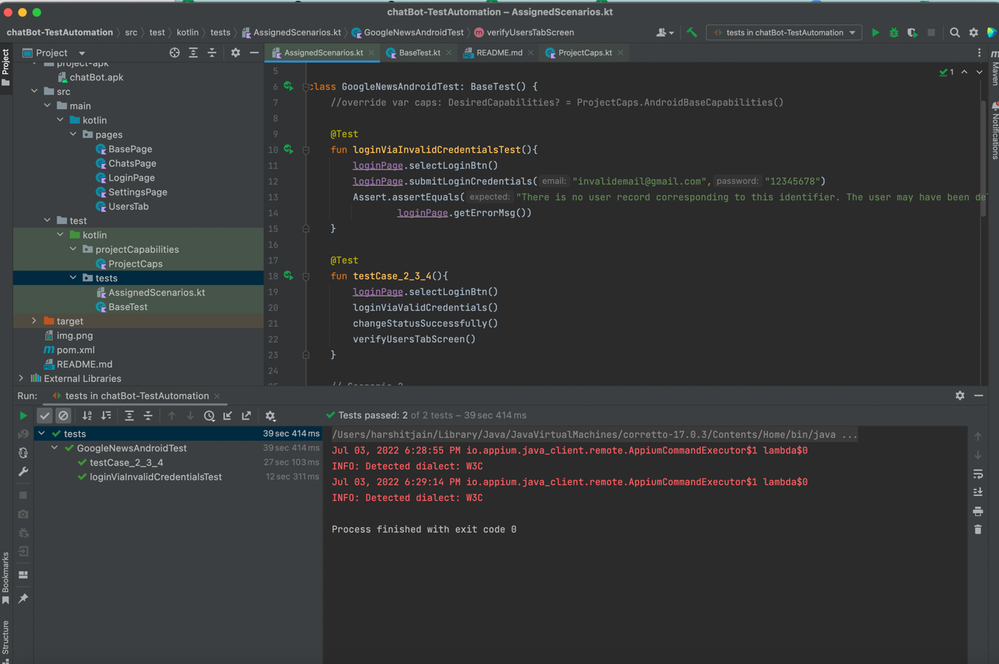

Task

	This is the basic project based on Kotlin, Appium, Junit and Selenium. I have tried to build a framework based on Page Object Model. 
    Repo of developer code is <https://github.com/adrianbudzynski/Chat-App-Android-Demo-Project.git> 

Tools/Technology Used

	1. Kotlin
	2. Appium
	3. Junit
	4. Selenium
	5. Maven
    6. Intellij
    7. Android Studio

Installation/Setup

	To run this project, you need to have java >= 1.8, maven, intellij, android studio and appium server installed on your machine.

Run Tests

	Step 1: Start the Appium server on the default port 4723
    Step 2: Import the project on Intellij
    Step 3: Update the absolute path of .apk file in src/test/kotlin/projectCapabilities/ProjectCaps.kt
    Step 4: Navigate to src/test/kotlin/tests and right click
    Step 5: Select option Run 'Tests in 'tests''

Description of how I have performed the task

    1. Cloned the code from the given repo: <https://github.com/adrianbudzynski/Chat-App-Android-Demo-Project>
    2. Imported the cloned code in Android Studio
    3. Build the code (Faced multiple issues with the versions of dependencies mentioned in Build.gradle)
    4. On successful build in debug mode generate an app-debug.apk file in build folder
    5. Used that apk file and automated the scenarios mentioned in the email with help of this framework

Execution Report

